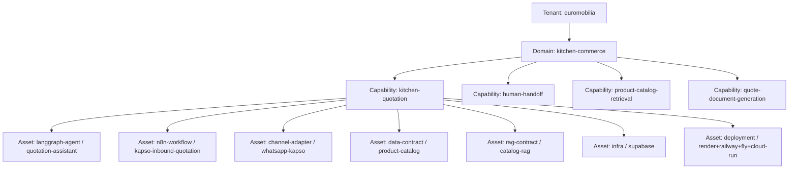

# Domain Model

> How this repository thinks about the world.

## Core Entities

### Tenant
A business entity that owns domains and capabilities. Example: `euromobilia`.

### Domain
A bounded context within a tenant. Example: `kitchen-commerce`.

### Capability
A business function inside a domain. Capabilities are the unit of ownership. Example: `kitchen-quotation`.

### Asset
An implementation artifact of a capability. Assets have types:
- `langgraph-agent`
- `n8n-workflow`
- `channel-adapter`
- `integration`
- `data-contract`
- `rag-contract`
- `infra`
- `deployment`
- `prompt`
- `eval`

## Relationships



`whatsapp-kapso` is one example channel. The same capability can reference additional channel adapters (Slack, Teams, web chat, Telegram, etc.) without changing the domain model; see [ADR-0007](knowledge/decisions/0007-multi-interface-deployment-for-tenant-assets.md).

## Invariants

1. Every asset belongs to exactly one capability.
2. Every capability belongs to exactly one domain.
3. Every domain belongs to exactly one tenant.
4. An asset MAY be referenced by multiple capabilities within the same tenant via explicit `dependencies`.
5. Cross-tenant references are FORBIDDEN.

## Asset Lifecycle

```
scaffolded → validated → compiled → deployed → monitored → deprecated → retired
```

States are tracked in `asset.yaml`.

## Glossary

| Term | Definition |
|------|------------|
| Capability | A business function with a defined input, output, and SLA |
| Asset | A deployable artifact that realizes (part of) a capability |
| Channel | A communication surface (WhatsApp, web chat, Slack, Teams, Telegram, email, etc.); each surface is typically a **channel-adapter** asset, and a capability may support **several** in parallel (see ADR-0007) |
| Contract | A schema-bound interface between assets |
| Scaffold | A reusable template for creating new instances |
