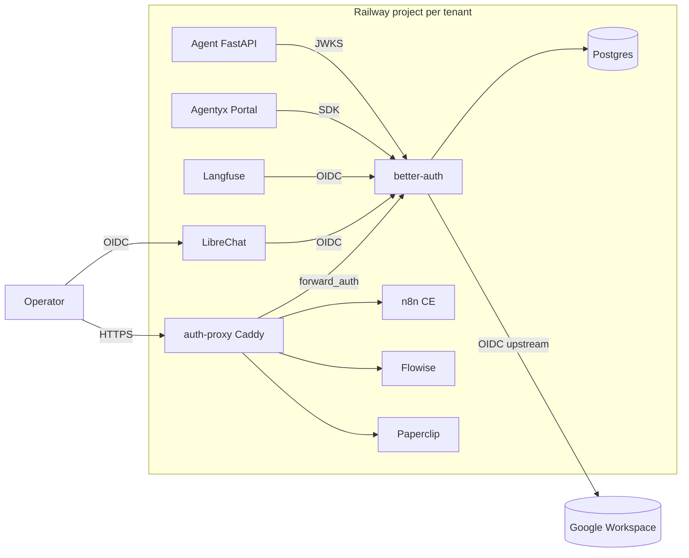

# ADR-0012: Better Auth as Per-Tenant Auth Federation

**Status:** Accepted  
**Date:** 2026-05-04

## Context

The Railway tenant stack (ADR-0010) exposes multiple human-facing services (n8n, LibreChat, Langfuse, Flowise, Paperclip, Agentyx Portal) with no unified identity layer. Each service has its own user store or basic-auth, creating operational friction and a poor operator experience. We need a single auth federation point per tenant that:

1. Authenticates operators via Google Workspace OIDC.
2. Provides email+password fallback for tenant-facing users.
3. Gates apps that don't speak OIDC natively (n8n CE, Flowise, Paperclip).
4. Federates with native-OIDC apps (LibreChat, Langfuse).
5. Issues JWTs verifiable by the Agent FastAPI service.

## Decision

1. **Deploy one `better-auth` service per tenant Railway project.** It runs as a Node/TypeScript service backed by the tenant's Postgres (`better_auth` logical DB).
2. **Use Caddy `forward_auth` (`auth-proxy` service)** to gate `n8n`, `Flowise`, and `Paperclip`. Unauthenticated requests are redirected to Better Auth; authenticated requests receive `X-Auth-User` and `X-Auth-Email` headers.
3. **Identity sources:**
   - **Google Workspace OIDC** — primary for operators (enforced via `GOOGLE_HD` hosted-domain restriction).
   - **Email + password** — fallback for tenant-facing users (stored in Better Auth's user table).
4. **OIDC federation:** LibreChat and Langfuse are configured as OIDC RPs against Better Auth's built-in OIDC-provider plugin.
5. **JWT verification:** The Agent FastAPI service verifies JWTs via `/.well-known/jwks.json` (no session cookie dependency).
6. **Agentyx Portal deferred integration:** The Portal SPA will use Better Auth's client SDK (`@better-auth/client`) when the SPA is built. Until then, the `better-auth` service operates standalone.
7. **Machine-to-machine traffic** (e.g., `n8n -> agent`) keeps existing API-key paths. Only human-facing ingress is gated.

## Topology

## Consequences

### Positive

- Single identity source per tenant.
- No passwords committed or shared across services.
- Operators sign in once via Google; session cookie gates all Caddy-proxied apps.
- Native-OIDC apps (LibreChat, Langfuse) federate without custom code.
- Agent verifies JWTs statelessly via JWKS.

### Negative

- Adds two services (`better-auth`, `auth-proxy`) to every tenant project.
- Caddy `forward_auth` introduces a small latency hit on each proxied request.
- OIDC-provider plugin is relatively new; we pin to a tested Better Auth version.

## Rejected alternatives

- **Authentik / Keycloak** — rejected to avoid another external dependency; Better Auth is lightweight and lives inside the tenant project.
- **Supabase Auth** — rejected because it would couple auth to an external Supabase project; per-tenant isolation is cleaner with a project-local auth service.
- **Basic auth per service** — rejected because it fragments identity and complicates password rotation.

## Follow-up

- Embed Better Auth directly inside the Agentyx Portal SPA once built (collapsing the standalone service into the app).
- Enforce `AUTH_REQUIRED=true` on the Agent FastAPI service per-tenant after rollout validation.
- Consider SCIM / org provisioning automation for bulk operator onboarding.
