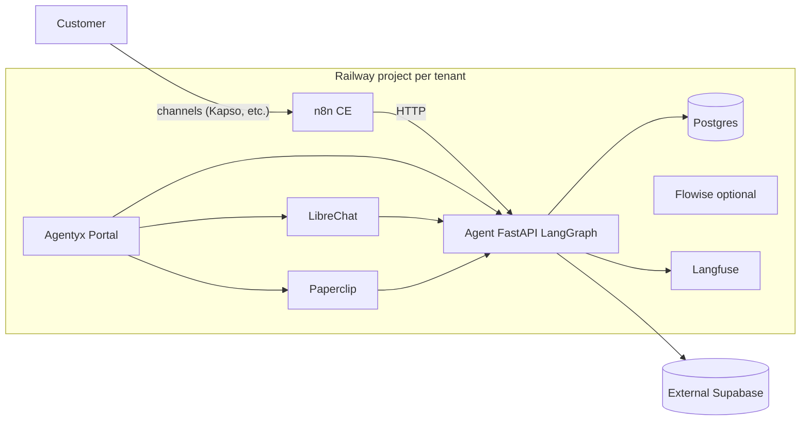

# Architecture

## Service responsibilities

### postgres
Railway Postgres plugin. One physical instance, multiple logical databases:
- `n8n` — n8n execution history and credentials metadata
- `langfuse` — Langfuse events and trace data
- `librechat` — LibreChat conversations and user data
- `paperclip` — Paperclip orchestration state

### n8n
n8n Community Edition. Receives inbound webhooks from channels (Kapso WhatsApp, etc.), orchestrates human handoff, and calls the `agent` service via internal URL.

### librechat
Chat UI with a "Custom Endpoint" pointing at the `agent` service. Operators and customers can converse through a web interface.

### paperclip
AI-team orchestrator. Manages multi-agent collaboration, tool registries, and team workflows.

### langfuse
Trace sink for all LLM calls made by the `agent` service. Does not run agents itself.

### agent
FastAPI + LangGraph agent runtime. Image is per-tenant/per-capability (e.g. `ghcr.io/<org>/euromobilia-agent-quotation-assistant`). The service slot is generic.

### agentyx-portal
Tenant-facing portal. Placeholder until the SPA image is built.

### flowise (optional)
Low-code agent builder. Disabled by default. Enable with `FLOWISE_ENABLED=true`.
