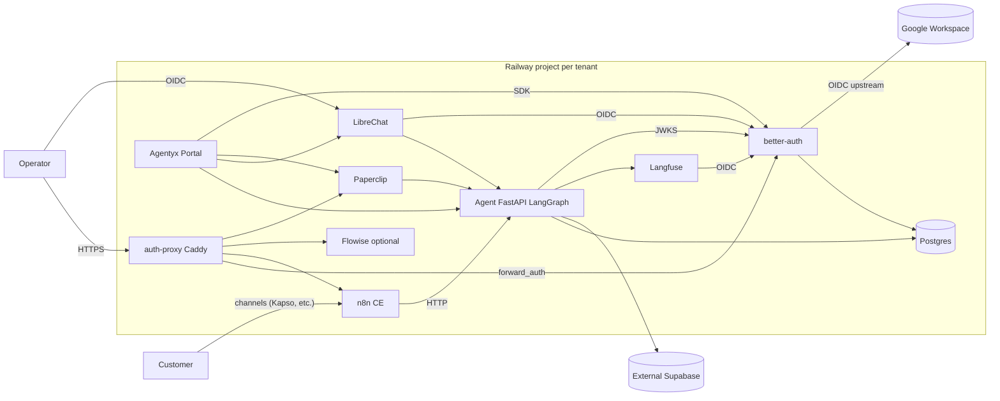

# Architecture

## Service responsibilities

### postgres
Railway Postgres plugin. One physical instance, multiple logical databases:
- `n8n` — n8n execution history and credentials metadata
- `langfuse` — Langfuse events and trace data
- `librechat` — LibreChat conversations and user data
- `paperclip` — Paperclip orchestration state
- `better_auth` — Better Auth user sessions and OIDC data

### better-auth
Per-tenant auth federation service. Exposes Better Auth core + OIDC provider plugin + Google Workspace social login + forward-auth endpoint for Caddy. Identity sources: Google Workspace OIDC (operators) and email+password (tenant-facing users).

### auth-proxy
Caddy 2 reverse proxy with `forward_auth` gating for `n8n`, `flowise`, and `paperclip`. Unauthenticated requests are redirected to Better Auth; authenticated requests receive `X-Auth-User` and `X-Auth-Email` headers.

### n8n
n8n Community Edition. Receives inbound webhooks from channels (Kapso WhatsApp, etc.), orchestrates human handoff, and calls the `agent` service via internal URL. Public access is via auth-proxy.

### librechat
Chat UI with a "Custom Endpoint" pointing at the `agent` service. Operators sign in via OIDC against Better Auth.

### paperclip
AI-team orchestrator. Manages multi-agent collaboration, tool registries, and team workflows. Public access is via auth-proxy.

### langfuse
Trace sink for all LLM calls made by the `agent` service. Operators sign in via OIDC against Better Auth.

### agent
FastAPI + LangGraph agent runtime. Image is per-tenant/per-capability (e.g. `ghcr.io/<org>/euromobilia-agent-quotation-assistant`). The service slot is generic. Can verify JWTs issued by Better Auth via JWKS.

### agentyx-portal
Tenant-facing portal. Placeholder until the SPA image is built. Will use the Better Auth client SDK when implemented.

### flowise (optional)
Low-code agent builder. Disabled by default. Enable with `FLOWISE_ENABLED=true`. Public access is via auth-proxy.

## Federation

- **Caddy forward-auth** gates n8n, Flowise, Paperclip.
- **OIDC** federates LibreChat and Langfuse directly.
- **JWKS** lets the Agent verify JWTs statelessly.
- **SDK** will let the Portal manage sessions natively.
- Machine-to-machine traffic (n8n → agent) keeps existing API-key paths.
