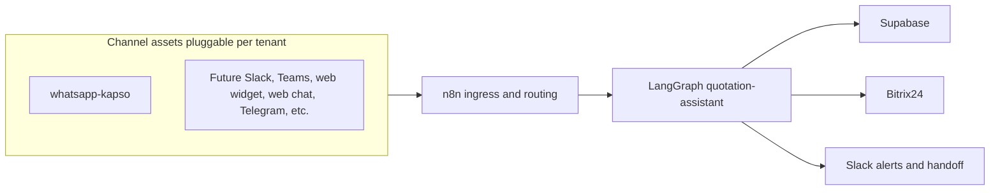

# Architecture

> Architecture documentation for kitchen-quotation.

The **capability** is not defined by a single vendor or channel. **Customer and operator interfaces** are pluggable **channel-adapter** assets; **Kapso WhatsApp** is the first wired example. See ADR-0007 (`knowledge/decisions/0007-multi-interface-deployment-for-tenant-assets.md`).

## Diagram

## Components

1. **Channel adapters** — Normalize inbound/outbound traffic per surface (e.g. `whatsapp-kapso`); add more assets for more surfaces.
2. **n8n** — Webhook ingress, deduplication, and routing (can fan in multiple channels over time).
3. **LangGraph** — Core quotation logic (interface-agnostic).
4. **Supabase** — Catalog, memory, and document storage
5. **Bitrix24** — CRM sync
6. **Slack** — Internal alerts and human handoff (distinct from “Slack as a customer channel” if added later).

## TODO

- [ ] Add sequence diagram
- [ ] Document failure modes
