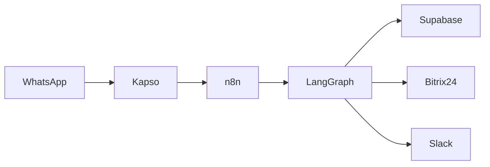

# Architecture

> Architecture documentation for kitchen-quotation.

## Diagram

## Components

1. **WhatsApp (Kapso)** — Customer messaging surface
2. **n8n** — Webhook ingress and routing
3. **LangGraph** — Core quotation logic
4. **Supabase** — Catalog, memory, and document storage
5. **Bitrix24** — CRM sync
6. **Slack** — Internal alerts

## TODO

- [ ] Add sequence diagram
- [ ] Document failure modes
